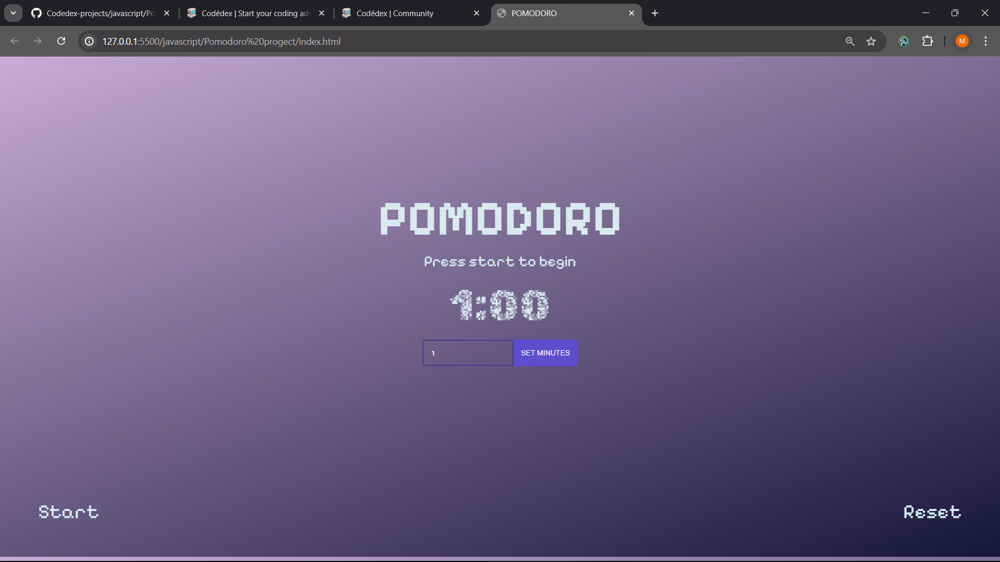

# Pomodoro Project

Welcome to the Pomodoro Project! This project aims to help you manage your time effectively using the Pomodoro Technique.

## What is the Pomodoro Technique?

The Pomodoro Technique is a time management method developed by Francesco Cirillo in the late 1980s. It uses a timer to break work into intervals, traditionally 25 minutes in length, separated by short breaks.

## Features

- Timer: Set a timer for your work sessions and breaks.

## Installation

To use the Pomodoro Project, follow these steps:

1. Clone the repository: `git clone https://github.com/Manoj-kumar2305/Codedex-projects/`

Note: After cloning, navigate to the Pomodoro project subdirectory within the repository to access the project.

## Usage

1. Open the Pomodoro Project application.
2. Set the timer duration for your work session.
3. Start the timer and begin working on your tasks.
4. Take breaks as scheduled.
5. Review your productivity and adjust your workflow accordingly.

## Contributing

Contributions are welcome! If you have any ideas, suggestions, or bug reports, please open an issue or submit a pull request.

## Screenshots

